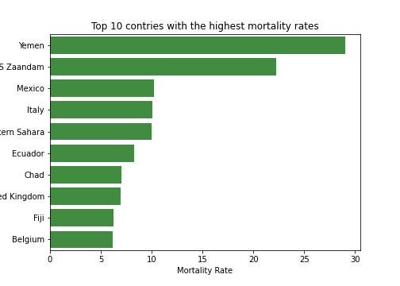

# Dsscription

This project is for analyzing data to show time evolutions and snapshots of Confirmed, Deaths and Mortality Rates in the worldwide and move to explore the evolution of the pandemics in the United States.

# Questions

- How did confirmed and death cases change over time?
- What is the trend of daily confirmed and death cases?
- What does the data on confirmed and death cases tell us about the mortality risk of COVID-19?

# Dataset

2019 Novel Coronavirus COVID-19 (2019-nCoV) Data Repository by Johns Hopkins CSSE. This dataset is updated daily by Johns Hopkins CSSE.
- Time series dataset ([Link raw file](https://raw.githubusercontent.com/CSSEGISandData/COVID-19/web-data/data/cases_time.csv))

The New York Times COVID-19 Data Repository and this dataset is updated daily by New York Times.
- COVID-19 cases for the US ([Link raw file](https://raw.githubusercontent.com/nytimes/covid-19-data/master/us-states.csv))

# Tools used

- Data cleaning using Python
- Jupyter Notebook
- Pandas
- Metplotlib
- Seaborn

# COVID-19 Analysis and Visualization

Distribution of COVID-19 cases world wide

Number of daily confirmed and deathes cases world wide

Top 10 countries of with the highest confrimed and deaths cases and mortality rates.

Distribution of COVID-19 cases in the United States

Number of daily confirmed and deathes cases in the United States

Top 10 states of with the highest confrimed and deaths cases and mortality rates.

