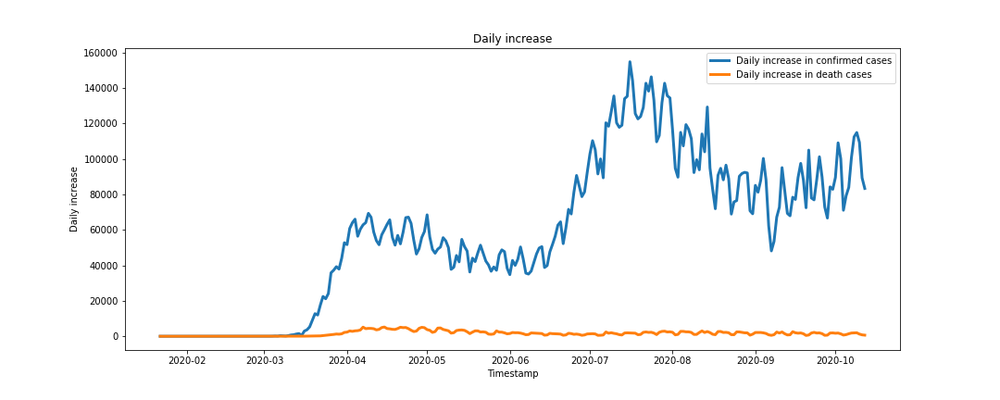

# COVID-19 Pandemic
Coronavirus is continuing its spread across the world, with more than 37 million confirmed cases in 189 countries and more than one million deaths.
This project is for analyzing data to show time evolutions and snapshots of Confirmed, Deaths and Mortality Rates in the worldwide and move to explore the evolution of the pandemics in the United States.

# Questions

- How did confirmed and death cases change over time?
- What is the trend of daily confirmed and death cases?
- What does the data on confirmed and death cases tell us about the mortality risk of COVID-19?

# Dataset

2019 Novel Coronavirus COVID-19 (2019-nCoV) Data Repository by Johns Hopkins CSSE. This dataset is updated daily by Johns Hopkins CSSE.
- Time series dataset ([Link raw file](https://raw.githubusercontent.com/CSSEGISandData/COVID-19/web-data/data/cases_time.csv))

The New York Times COVID-19 Data Repository and this dataset is updated daily by New York Times.
- COVID-19 cases for the US ([Link raw file](https://raw.githubusercontent.com/nytimes/covid-19-data/master/us-states.csv))

# Chart Summary

Covid-19 time series

Covid-19 confirmed cases have seen a sharp increase since July 2020, similar in the U.S. and around the world.

Daily New Deaths and Cases in the global

Daily New Deaths and Cases in the United States

# Tools used

- Data cleaning using Python
- Jupyter Notebook
- Pandas
- Metplotlib
- Seaborn

